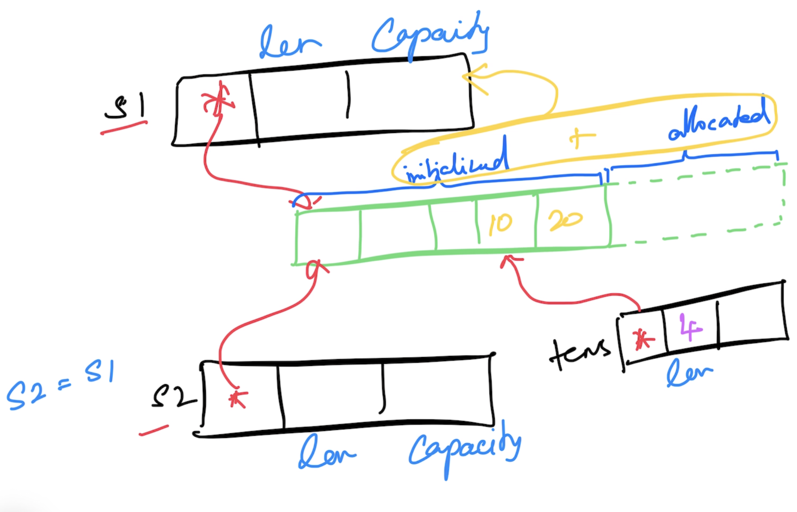

# Go Foundation

## Magesh Kuppan

## Schedule
- Commence      : 9:00 AM
- Tea Break     : 10:30 AM (20 mins)
- Lunch Break   : 12:30 PM (1 hr)
- Tea Break     : 3:00 PM (20 mins)
- Wind up       : 5:00 PM

## Methodology
- No powerpoint
- 100% Code driven

## Software Requirements
- Go Tools (https://go.dev/dl)
- Visual Studio Code (https://code.visualstudio.com)
- Go Extension for VSCode
- Docker Desktop

## Repository
- https://github.com/tkmagesh/thoughtclan-go-dec-2023

## Why Go?
- Simplicity
    - ONLY 25 keywords
    - No access modifiers (public/private/protected)
    - No classes (only structs)
    - No inheritance (only composition)
    - No function overloading
    - No implicit type conversion
    - No exceptions (only errors)
    - No "try catch finally" constructs
    - No reference types (everything is a value)
    - No pointer arithmatic
- Performance
    - Equivalent to C++
    - Close to the hardware
        - Compiled to machine code
        - Platform specific builds are needed
        - No JIT compilation
    - Support for cross compilation
- Managed Concurrency
    - Concurrency
        - Ability to have more than one execution path
    - Built in Scheduler
        - N : M scheduler where N = # of goroutines & M = # of OS threads
        - N >= M
    - Concurrent operations are represented as Goroutines (cheap, ONLY 4KB)
    - Concurrency features are built in the language
        - go keyword, channel data type, channel operator ( <- ), range, select-case constructs
    - APIs support
        - "sync" package
        - "sync/atomic" package

## Go Programs
### To compile & execute
> go run [filename.go]
### To compile
- > go build [filename.go]
- > go build -o [binary_name] [filename.go]
### To list the environment variables
- > go env
- > go env [var_1] [var_2]...
### To update the environment variables
- > go env -w [var_1 = val_1] [var_2 = val_2]...
### Environment variables for cross compilation
- GOARCH
- GOOS
### To get the supported platforms for cross compilation
> go tool dist list
### To cross compile
> GOOS=[target_os] GOARCH=[target_arch] go build [filename.go]

## Data Types
- bool
- string
- integer types
    - int8
    - int16
    - int32
    - int64
    - int
- unsigned integer types
    - uint8
    - uint16
    - uint32
    - uint64
    - uint
- float types
    - float32
    - float64
- complex types
    - complex64 (real[float32] + imaginary[float32])
    - complex128 (real[float64] + imaginary[float64])
- type aliases
    - byte (alias for uint8)
    - rune (alias for int32 / unicode code point)
## Variable Declaration
- Using "var" keyword
- Using ":="
- Function scoped variables
    - Can use ":="
    - Cannot have unused variables
- Package scoped variables
    - Cannot use ":="
    - Can have unused variables
## Programming Constructs
### if else

### switch case

### for

### func
- functions can have more than one return result
- named results
- anonymous functions
- higher order functions (functions can be treated like data)
    - assign functions as values to variables
    - pass functions as arguments to other functions
    - return functions as return values from other functions
- variadic functions
## Errors
- values implementing "error" interface (Error() method)
- The default value of any interface is nil
- Creation
    - errors.New()
    - fmt.Errorf()
- Errors are NOT thrown but returned
## Deferred functions
- Any common logic that need to executed when returned from a function can be encapsulated in a deferred function
- functions whose execution is postponed until the current function exits
- Prefix the function execution call with "defer" keyword
- deferred functions are executed in the reverse order
## Panic & Recovery
### Panic
- A panic is said to have occured when the application reaches a state where the application execution cannot proceed any further
- When a panic occurs, the deferred function will be executed
- Use "panic()" function to programmatically create a panic
### Recovery
- "recover()" function returns the error that resulted in a panic
## Collections
### Array
- Fixed size typed collection
### Slice
- Varying size typed collection
- A slice is a pointer to an underlying array
- use "append()" to add new items
- use "len()" to get the # of items that are accessible from the underlying array
- use "cap()" to get the memory allocated (initialized + uninitialized)

### Map
- typed collection of key/value pairs
- initialization can be done with make() function
- use "delete()" to remove an item
## Modularity
### Module
- any code that need to be versioned & deployed together
- a folder with the "go.mod" file
- go.mod
    - manifest file for the module
    - contains
        - name of the module (typically the repo path)
        - go runtime version targetted
        - information about 3rd party dependencies
### Package
- internal organization module
- typically folders
### Commands
- To create a module file
    > go mod init [module_name]
- To create a build of a module
    > go build .
- To execute a module
    > go run .
- To include a 3rd party dependency
    > go get [module_name]
- To update the go.mod file 
    > go mod tidy
- To download the dependencies (documented in the go.mod file)
    > go mod download
- To get the dependency graph
    > go mod graph
- To get the dependency graph of one module
    > go mod why [module_name]
- To install a 3rd party module as an executable (CLI tools) (installed in the $GOPATH/bin folder)
    > go install [module_name]
- Reference:
    - https://go.dev/ref/mod

## Structs
- Class like construct
- Values

## Methods
- Functions with receivers
- Both the struct definition and the method definition must be in the same package
- Use type aliasing for defining methods on structs that are not local